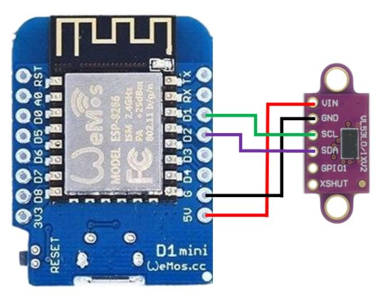
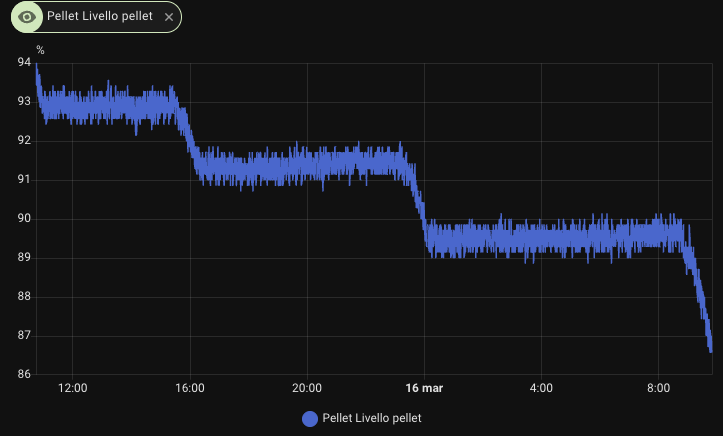

# ESPHome Pellet Level Sensor Setup (macOS / Windows / Linux)

Guide to install **ESPHome from scratch on macOS, Windows, or Linux** and upload firmware for:

-   AZDelivery **D1 Mini ESP8266**
-   AZDelivery **VL53L0X ToF distance sensor**

## Hardware used

-   D1 Mini ESP8266\
    https://www.amazon.it/dp/B01N9RXGHY

-   VL53L0X ToF sensor\
    https://www.amazon.it/dp/B086V37JJ7

------------------------------------------------------------------------

# Hardware wiring



| D1 Mini pin | VL53L0X sensor pin | Meaning |
| --- | --- | --- |
| 5V | VIN | Positive 5V power |
| GND | GND | Ground / power negative |
| D1 | SCL | I2C bus clock line |
| D2 | SDA | I2C bus data line |

------------------------------------------------------------------------

# 1 ESPHome installation (macOS / Windows / Linux)

ESPHome is used to:

- create firmware configuration using YAML files
- compile firmware for ESP8266/ESP32
- upload firmware over USB and perform OTA updates
- expose sensors and devices in Home Assistant

## macOS

Install `pipx`:

``` bash
brew install pipx
```

Add `pipx` to PATH:

``` bash
pipx ensurepath
exec $SHELL
```

Install ESPHome and verify:

``` bash
pipx install esphome
esphome version
```

## Windows (PowerShell)

Install `pipx`:

``` powershell
py -m pip install --user pipx
py -m pipx ensurepath
```

Close and reopen PowerShell, then install ESPHome:

``` powershell
pipx install esphome
esphome version
```

## Linux

Install `pipx` (Debian/Ubuntu):

``` bash
sudo apt update
sudo apt install -y pipx
```

Add `pipx` to PATH:

``` bash
pipx ensurepath
exec $SHELL
```

Install ESPHome and verify:

``` bash
pipx install esphome
esphome version
```

If your distro does not provide `pipx` in the package manager:

``` bash
python3 -m pip install --user pipx
python3 -m pipx ensurepath
```

------------------------------------------------------------------------

# 2 Create project folder

``` bash
mkdir -p ~/Documents/GitHub/esphome
```

``` bash
cd ~/Documents/GitHub/esphome
```

------------------------------------------------------------------------

# 3 Create ESPHome configuration

Run the wizard:

``` bash
esphome wizard pellet.yaml
```

During the wizard, enter:

    board: d1_mini
    wifi ssid
    wifi password

------------------------------------------------------------------------

# 4 Connect D1 Mini via USB

Check the serial port:

``` bash
ls /dev/cu.*
```

Example output:

    /dev/cu.usbserial-11320

------------------------------------------------------------------------

# 5 Edit configuration

Open the file:

``` bash
vim pellet.yaml
```

Insert this configuration:

``` yaml
esphome:
  name: pellet

esp8266:
  board: d1_mini

# Enable logging
logger:

# Enable Home Assistant API
api:
  encryption:
    key: "YOUR_API_ENCRYPTION_KEY"

ota:
  - platform: esphome

wifi:
  ssid: "YOUR_WIFI_SSID"
  password: "YOUR_WIFI_PASSWORD"
  min_auth_mode: WPA2

  # Enable fallback hotspot (captive portal) in case wifi connection fails
  ap:
    ssid: "Pellet Fallback Hotspot"
    password: "YOUR_FALLBACK_AP_PASSWORD"

captive_portal:

i2c:
  sda: D2
  scl: D1
  scan: true
  id: bus_a

sensor:
  - platform: vl53l0x
    id: distance_sensor
    name: "Pellet Distance"
    address: 0x29
    update_interval: 10s
    long_range: false

  - platform: template
    id: level
    name: "Pellet Level"
    unit_of_measurement: "%"
    update_interval: 1s
    lambda: |-
      if (isnan(id(distance_sensor).state)) return 0;
      auto r = (id(distance_sensor).state - 0.8) * (100.0 - 0.0) / (0.1 - 0.8) + 0.0;
      if (r > 100) return 100;
      if (r < 0) return 0;
      return r;
```

------------------------------------------------------------------------

# 6 Compile and upload firmware

``` bash
esphome run pellet.yaml
```

When prompted, select the USB port:

    1

Example:

    [1] /dev/cu.usbserial-11320

------------------------------------------------------------------------

# 7 Verify operation

In ESPHome logs, you should see values similar to:

    Pellet distance: 0.19 m
    Pellet level: 86 %

------------------------------------------------------------------------

# 8 Home Assistant integration

Once connected to Wi-Fi:

    Settings
    Devices & Services
    ESPHome
    Add device

Enter the **API key generated by the wizard**.

------------------------------------------------------------------------

# Available sensors in Home Assistant

    sensor.pellet_pellet_distance
    sensor.pellet_pellet_level

------------------------------------------------------------------------

# Example dashboard

- gauge -> pellet level
- tile -> pellet distance
- history graph -> pellet consumption



